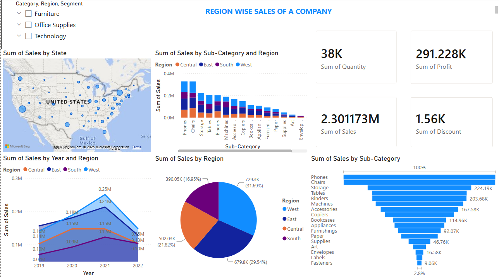

# 📊 Power BI Sales Dashboard

Interactive Sales Dashboard built using Microsoft Power BI.

---

## Dashboard Preview

---

## Project Overview

This dashboard helps analyze business performance using sales data.

### KPIs

- 💰 Total Sales
- 📈 Total Profit
- 📦 Total Quantity
- 💲 Total Discount

---

## Visualizations

- 🌎 Map Chart
- 📊 Stacked Column Chart
- 📈 Line Chart
- 🥧 Pie Chart
- 🔻 Funnel Chart
- 🎯 KPI Cards
- 🎛️ Interactive Slicers

---

## Dataset

Superstore Orders Dataset

---

## Tools Used

- Microsoft Power BI
- Microsoft Excel
- DAX

---

## Business Insights

- West region has the highest sales.
- Chairs are the top-selling product category.
- Profit differs significantly by region.
- Interactive filters allow dynamic analysis.

---

## Files

| File | Description |
|------|-------------|
| Sales_Dashboard.pbix | Power BI project |
| Sales_Dashboard.pdf | Exported dashboard |
| Superstore_Orders.csv | Dataset |

---

## Author

Yuvraj Chaudhary
